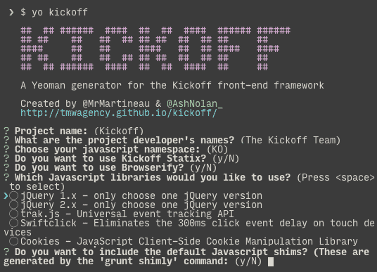

## [Yeoman](http://yeoman.io) generator for the [Kickoff framework](https://github.com/tmwagency/kickoff/)
[](https://gitter.im/tmwagency/generator-kickoff?utm_source=badge&utm_medium=badge&utm_campaign=pr-badge&utm_content=badge)

Using our Yeoman Generator is the best and fastest way to get Kickoff each time you want to start a new project. It will ask you a few questions and then build a custom version of [Kickoff version 4.0.1](https://github.com/tmwagency/kickoff/releases/tag/4.0.1) for your needs.

## What is Yeoman?
Yeoman helps you kickstart new projects, prescribing best practices and tools to help you stay productive. Yeoman is open-source but is maintained by a number of people from Google.

We have created a generator that once installed, allows you to create a custom build of Kickoff whenever you need.

## Installation

### Install Yeoman
If you haven't installed Yeoman yet, run this command in your terminal:

```shell
npm install -g yo
```

### Install the generator
To install generator-kickoff from npm, run:

```shell
npm install -g generator-kickoff
```

### Install them both :)
```shell
npm install -g yo generator-kickoff
```

Finally, initiate the generator:

```shell
yo kickoff
```

## The Kickoff generator asks for this information:
1. Project name
1. What are the project developer's names?
1. Choose your javascript namespace (default is `KO`)
1. Do you want to use Kickoff [Statix](/kickoff/statix/)? (y/N)
1. Do you want to use Browserify? (y/N)
1. Which javascript libraries would you like to use? jQuery v1.x/2.x, Trak.js, Swiftclick & Cookies are the options
1. Would you like to use [Grunticon](https://github.com/filamentgroup/grunticon)? (y/N)
1. Do you want to include the default Javascript shims? (These are generated by the `grunt shimly` command) (y/N)



The repo and more information can be found at [github.com/tmwagency/generator-kickoff](https://github.com/tmwagency/generator-kickoff)

[](https://nodei.co/npm/generator-kickoff/)

[](http://badge.fury.io/js/generator-kickoff)
If you'd like to get to know Yeoman better and meet some of his friends, [Grunt](http://gruntjs.com) and [Bower](http://bower.io), check out the complete [Getting Started Guide](https://github.com/yeoman/yeoman/wiki/Getting-Started).


## License

[MIT License](http://en.wikipedia.org/wiki/MIT_License)


